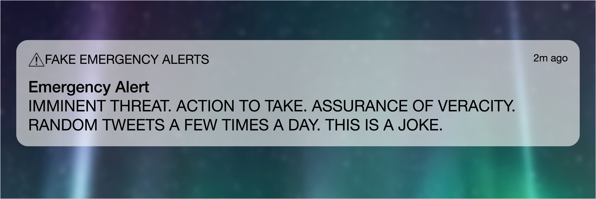

# FakeAlertsBot


[@FakeAlertsBot](https://twitter.com/FakeAlertsBot) is a Twitter bot to tweet out made-up "Emergency Alerts" in the style of iOS's Emergency Alert functionality.

## Quickstart

1. Get a set of [Twitter API keys](https://apps.twitter.com)
2. Run the Docker container from the latest published image

```bash
docker run -e CONSUMER_KEY=your_info_here -e CONSUMER_SECRET=your_info_here -e ACCESS_TOKEN_KEY=your_info_here -e ACCESS_TOKEN_SECRET=your_info_here thzinc/fakealertsbot
```

If you want to run the code locally, set the following environment variables with your Twitter API key info, then run `npm run start`:

* `CONSUMER_KEY`
* `CONSUMER_SECRET`
* `ACCESS_TOKEN_KEY`
* `ACCESS_TOKEN_SECRET`

## Building

[](https://hub.docker.com/r/thzinc/fakealertsbot/)

Build the Docker image locally:

```bash
docker build -t thzinc/fakealertsbot:devel .
```

Then run it:

```bash
docker run -e CONSUMER_KEY=your_info_here -e CONSUMER_SECRET=your_info_here -e ACCESS_TOKEN_KEY=your_info_here -e ACCESS_TOKEN_SECRET=your_info_here thzinc/fakealertsbot:devel
```

## Code of Conduct

We are committed to fostering an open and welcoming environment. Please read our [code of conduct](CODE_OF_CONDUCT.md) before participating in or contributing to this project.

## Contributing

We welcome contributions and collaboration on this project. Please read our [contributor's guide](CONTRIBUTING.md) to understand how best to work with us.

## License and Authors

[ Daniel James](https://github.com/thzinc)

[](https://github.com/thzinc/FakeAlertsBot/blob/master/LICENSE)
[](https://github.com/thzinc/FakeAlertsBot/graphs/contributors)

This software is made available by Daniel James under the MIT license.